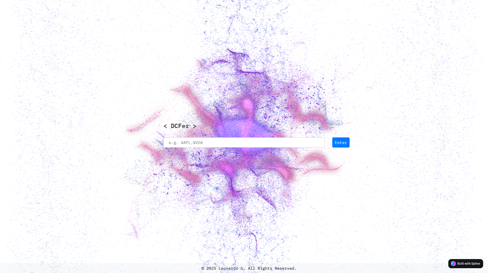

# Discounted Cash Flow (DCF) Projection

This project is a **Discounted Cash Flow (DCF)** analysis web application that allows users to input stock ticker symbols (e.g., `AAPL`, `NVDA`) and receive projections on a company’s free cash flow, weighted average cost of capital (WACC), Altman Z-score, and overall discounted cash flow analysis.





## Key Features

- **Stock Data Integration:** Utilizes Yahoo Finance API for real-time stock data and financial metrics.
- **DCF Calculation:** Provides future cash flow projections using CAPM, cost of equity, WACC, and growth rate calculations.
- **Altman Z-Score:** Evaluates the financial health and default risk of a company.
- **Interactive Interface:** Responsive and animated UI with typing effects for an engaging user experience.
- **News Sentiment Weighting:** Incorporates recent financial news to adjust cash flow multipliers.

---

## Project Structure

```
/static
│   ├── style.css      # Stylesheet for the web app
│   ├── script.js      # Front-end JavaScript logic
│
/templates
│   └── index.html     # Main HTML template
|
app.py                 # Flask backend for processing API requests
README.md              # Documentation
```

### File Details:
- **`app.py`**: Backend Flask app that fetches financial data, performs calculations, and serves the frontend.
- **`index.html`**: Frontend structure with a modern layout using Spline animations.
- **`style.css`**: Provides styling, animations, and responsive design for the web interface.
- **`script.js`**: Handles user interaction, data submission, and typing animations on the UI.

---

## Installation and Usage

### Prerequisites

Ensure you have the following installed:
- **Python 3.x**
- **Node.js** (optional for advanced debugging)
- Libraries:
  - Flask
  - Yahoo Finance (yfinance)
  - Yahoo Fin (for news)
  - OpenAI API (if GPT integration is needed)

### Steps

1. Clone this repository:
   ```bash
   git clone <repository-url>
   cd <repository-folder>
   ```

2. Install dependencies:
   ```bash
   pip install flask yfinance yahoo_fin
   ```

3. Set up OpenAI API key:
   - Add your OpenAI API key in `app.py`:
   ```python
   api_key = "your-openai-api-key"
   ```

4. Run the Flask app:
   ```bash
   python app.py
   ```

5. Open your browser and navigate to:
   ```
   http://127.0.0.1:5000
   ```

---

## How It Works

1. **Enter a Ticker Symbol:** Users input a stock symbol (e.g., `AAPL`, `NVDA`).
2. **Submit the Request:** The app fetches financial data from Yahoo Finance and news sentiment analysis.
3. **Results Display:** The app shows financial metrics like WACC, free cash flow projections, and the discounted cash flow result in a detailed, interactive format.

---

## Sample Output

| **Metric**       | **Value**       |
|------------------|-----------------|
| Free Cash Flow   | $10,000,000      |
| WACC             | 7.5%             |
| DCF Valuation    | $120,000,000     |
| Altman Z-Score   | 2.5 (Moderate Risk) |

---

## Customization

- **Style Customization:** Modify `style.css` for UI changes.
- **API Configuration:** Adjust Yahoo Finance and OpenAI configurations in `app.py`.
- **Spline Animation:** Replace the 3D animation URL in `index.html` with your own Spline design.

---

## Dependencies

- `Flask` - Web framework for serving the app.
- `yfinance` - Fetches stock data and financial reports.
- `yahoo_fin` - Retrieves the latest financial news.
- `OpenAI` API (optional) - For sentiment analysis.

---

## Future Improvements

- Add support for ETFs and cryptocurrency analysis.
- Improve error handling for invalid stock symbols or missing data.
- Extend sentiment analysis with custom weighting schemes.

---

## License

This project is licensed under the MIT License. See `LICENSE` for details.

---

## Credits

Developed by **Leonardo G.** © 2025.  
Spline 3D assets from [Spline Tool](https://spline.design/).
